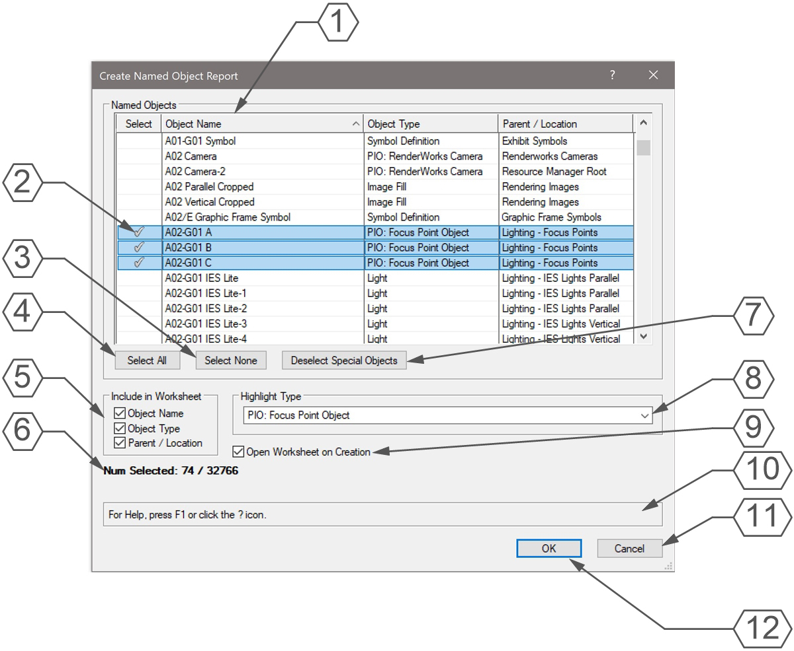
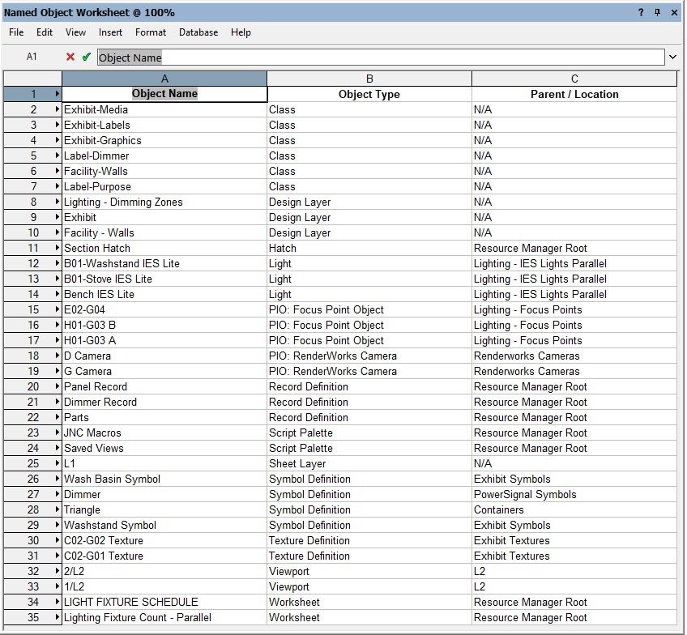

# Create Named Object Report

Menu Command

## Version

1.0.0 - 1/7/2025

This plug-in is written in Vectorscript (Pascal) and can be used in any version of [Vectorworks](https://www.vectorworks.net) 2019 or newer.

## Description

Running this menu command will open a dialog displaying all named objects in the active drawing. Pressing **OK** will process selected object names into a Worksheet. Please note that all objects aside from Layers share a common name pool. Layers have their own unique name pool.

## Instructions

1. Run menu command.
2. Select which object names to include in the report Worksheet by placing a "checkmark" in the **Select** column next to the chosen object name. All objects names are selected by default.
3. Click on a column header to sort the object names by the chosen column. Object names will be sorted by **Object Type** by default. The resulting Worksheet will be sorted to match the dialog.
4. Press the **Deselect Special Objects** button to deselect object names of "hidden" object names. These are names used "under the hood" and usually start with a double underscore ("__") or a "NNA" prefix.
5. Choose which columns to include in the report Worksheet. By default all columns will be included. When the **OK** button is pressed, these settings will be saved for the next time the menu command is run.
6. If all object names of a specific object type want to be selected or deselected, click on the **Highlight Type** drop-down menu and select an object type.
7. Once all desired object names are selected, press the **OK** button.
8. Enter a name for the report Worksheet in the prompt. This name must be unique or match the name of an existing Worksheet object. If the entered name matches an existing Worksheet, the user will be prompted to authorize overwriting the Worksheet.

## Dialog Box Explanation

1. Click on a column header to sort by that column. Object names will be sorted by **Object Type** by default. The report Worksheet sorting will match this dialog box.
2. Click on the **Select** column to mark an object name to be added to the report Worksheet. All object names will be selected by default.
3. Press the **Select None** button to deselect all object names.
4. Press the **Select All** button to mark all object names to be added to the report Worksheet.
5. Check the boxes next to the names matching the column headers to include the column in the report Worksheet. All boxes will be checked by default, but their state will be saved when the **OK** button is pressed. Their state will be restored next time the command is run.
6. Worksheets have a hard row cap of 32767 rows. This indicator will show how many objects are currently selected to be in the report Worksheet. If more object names than 32766 are selected, the first 32766 will be included in the report.
7. Press the **Deselect Special Objects** to deselect background system names. These names typically start with "__" or "NNA".
8. Select a Type from the **Highlight Type** drop-down to highlight all named objects of the chosen Type to quickly select or deselect them.
9. Check the **Open Worksheet on Creation** box to open the Worksheet immediately after it is created.
10. **Help Box**, mousing over any dialog box element will display an explanation here.
11. Press the **Cancel** button to close the dialog without saving settings or creating a report Worksheet.
12. Press the **OK** button to open a prompt for the name of the report Worksheet. Once a unique name is entered or an existing Worksheet name has been authorized to be overwritten, the report Worksheet will be created.

## Worksheet Example

## Installation Instructions

There are two methods of installation, direct download of the plug-in or through the **JNC Tools Free Manager** plug-in.

### Direct Download:

1. Download [source plug-in file](Create%20Named%20Object%Report.vsm))
2. Place downloaded file inside the **Vectorworks User Folder** within the **Plug-ins** directory
3. Restart Vectorworks

### JNC Tools Free Manager

1. Run the [**JNC Tools Free Manager**](https://jncogs.github.io/JNC-Tools-Manager-Free/) menu command
2. Select the **Create Named Object Report** command
3. Press the **Install / Update** button
4. Press **Close** to close the dialog box
5. Restart Vectorworks

## Adding the Plug-in to your Workspace

1. Open the **Workspace Editor** by going to **Tools - Workspaces - Edit Current Workspace**
2. Select the **Menus** tab
3. In the box on the left, find and expand the **JNC** category
4. In the box on the right, find a suitable menu to place the command in, such as **Tools** or **Modify**
5. Click and drag the **Create Named Object Report** command from the box on the left to the desired menu location in the box on the right
6. Click **OK** to close the editor

## Localization Instructions

The plug-in can be localized to your native language without having access to the source code.  This can be achieved by following the instructions below:

1. Open the **Plug-in Manager** by going to **Tools - Plug-ins - Plug-in Manager**
2. Select the **Third-party Plug-ins** tab
3. Select the **Create Named Object Report** command
4. Click the **Customize** button
5. Select the **Strings** tab
6. Double-click a category, such as **Dialog Strings**
7. Select a string to edit and press the **Edit** button
8. Write a new string and press the **OK** button until you are back to the **Plug-in Manager**

The categories for this plug-in are as follows:

- **3000** - *Dialog Strings*: These strings are used in the dialog box and can all freely be changed.
- **4000** - *Dialog Help Strings*: These strings are used in the Help Box and can all freely be changed.
- **5000** - *Misc Strings*: These strings serve multiple purposes in the code, but are mostly Alerts that appear in the dialog boxes. Do not change **5000** or **5001**.
- **6000** - *Object Types*: These strings are used to identify the object types of the named objects. These type numbers are found in the [Vectorscript Appendix](https://developer.vectorworks.net/index.php?title=VS:Function_Reference_Appendix_D) and have 6000 added to them. For example, **Line** objects are Type 2, so string **6002** is set to **Line**. Not all object types appear in the Appendix, so if an **Object Type** column is blank, use the [GetTypeN](https://developer.vectorworks.net/index.php?title=VS:GetTypeN) function to determine the number and edit the requisite string to add the object type name.

## Release Notes

| Date | Version | Note |
| :---: | :---: | :--- |
| 01/07/2025 | 1.0.0 | Initial release |

## Known Bugs

No Known Bugs

## Feature Requests

| Date Logged | Request |
| :---: | :--- |
| 01/07/2025 | Add Parent Type column to list browser and worksheet |

## License

Copyright (c) Jesse Cogswell (JNC Tools)

Permission is hereby granted, free of charge, to any person or organization
obtaining a copy of this software (the "User") and associated documentation files (the "Software"),
to use, reproduce, distribute, execute, and transmit the Software.

The User is not permitted to modify or attempt to reverse engineer the source code.  The User may
localize the Software using approved methods from within the Vectorworks software.

THE SOFTWARE IS PROVIDED "AS IS", WITHOUT WARRANTY OF ANY KIND, EXPRESS OR
IMPLIED, INCLUDING BUT NOT LIMITED TO THE WARRANTIES OF MERCHANTABILITY,
FITNESS FOR A PARTICULAR PURPOSE, TITLE AND NON-INFRINGEMENT. IN NO EVENT
SHALL THE COPYRIGHT HOLDERS OR ANYONE DISTRIBUTING THE SOFTWARE BE LIABLE
FOR ANY DAMAGES OR OTHER LIABILITY, WHETHER IN CONTRACT, TORT OR OTHERWISE,
ARISING FROM, OUT OF OR IN CONNECTION WITH THE SOFTWARE OR THE USE OR OTHER
DEALINGS IN THE SOFTWARE.